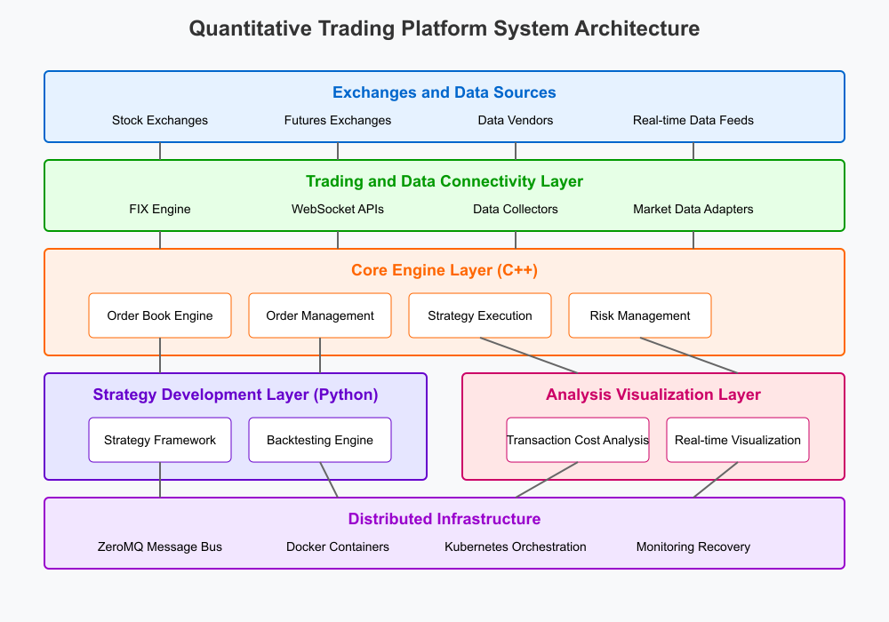

# TradeMind Conceptual Overview

## Audience

This document is intended for Trading System Engineers, DevOps personnel, and System Administrators responsible for building, deploying, configuring, and monitoring the TradeMind algorithmic trading platform. It assumes you possess strong technical skills, including proficiency in C++ and Python, and have experience with low-latency systems, distributed architectures (like microservices), networking concepts (including FIX protocol familiarity), containerization (Docker), orchestration (Kubernetes), and Linux/Unix system administration.

## Scope

This overview provides a high-level understanding of the TradeMind platform's architecture, core components, key technologies, and operational concepts. It focuses on the aspects relevant to setting up, running, and ensuring the stability and performance of the system infrastructure.

This document will cover the following topics:

*   What is TradeMind?
*   TradeMind Architecture
*   Key Concepts
*   Strategy Deployment Workflow (System Engineer Perspective)
*   Tools and Environment

## What is TradeMind?

TradeMind is a high-performance, distributed algorithmic trading platform designed for low-latency execution and sophisticated strategy support. From an engineering perspective, its key characteristic is a hybrid architecture made of the following components:

*   A **high-performance core engine built in C++** handles time-critical operations like order book management, order routing, risk checks, and connectivity to exchanges via protocols like FIX ensuring microsecond-level processing capabilities.
*   A **flexible Python layer** provides the interface for quantitative traders to develop, test, and run their trading strategies. This layer interacts with the C++ core for execution and data.
*   A **distributed, microservices-based infrastructure** leveraging technologies like ZeroMQ, Docker, and Kubernetes allows for scalability, resilience, and flexible deployment across various environments (on-premises or cloud).

As a System Engineer you will primarily be working with the C++ core and the distributed infrastructure.

## TradeMind Architecture

Understanding how the following layers interact will be crucial for deployment and troubleshooting:

### 1. Exchanges and Data Sources Layer (External)
*   **Function:** Provides the raw market data (quotes, trades) and serves as the destination for orders.
*   **Relevance:** You will likely need to configure TradeMind's connectivity to these specific exchanges and data feeds if not using proprietary data sources. This involves parameters detailed in the [*TradeMind Configuration Guide*](Config_guide.md).

### 2. Trading and Data Connectivity Layer
*   **Function:** Manages communication between the TradeMind Core Engine and the external exchanges/data sources.
*   **Key Components:**
    *   **FIX Engine:** Manages persistent sessions with exchanges using the FIX protocol for order entry and market data. Requires careful configuration (Session IDs, IPs, ports).
    *   **WebSocket APIs:** Used for connecting to more modern data feeds or potentially custom interfaces.
    *   **Market Data Adapters:** Specific modules responsible for parsing data from different vendor formats or exchange protocols into a standardized internal format.
*   **Relevance:** This is a key configuration and monitoring point. Careful adapter setup, FIX session stability, and efficient data flow are critical for system reliability.

### 3. Core Engine Layer (C++)
*   **Function:** Processes market data, manages order lifecycle, executes strategy logic (delegated from Python), and performs real-time risk management.
*   **Key Components:** Order Book Engine, Order Management System (OMS), Strategy Execution Engine (hosting/calling strategy logic), Real-time Risk Management module.
*   **Relevance:** This is the core C++ application you will build, configure (performance tuning, logging via [*TradeMind Configuration Guide*](Config_guide.md)), and monitor closely for CPU usage, memory, and latency metrics.

### 4. Strategy Development Layer (Python)
*   **Function:** Provides the environment for quantitative traders to write and test strategies. Interfaces with the Core Engine for data and execution commands.
*   **Key Components:** Python API, Backtesting Engine.
*   **Relevance:** While you might not be developing strategies, you will need to ensure the Python environment is correctly set up, dependencies are installed, and that Python processes can communicate effectively (e.g., via ZeroMQ) with the C++ Core Engine. You'll manage the deployment of this layer alongside the core.

### 5. Analysis & Visualization Layer
*   **Function:** Provides tools for analyzing trading performance and visualizing system/market data.
*   **Key Components:** Transaction Cost Analysis (TCA) tools, Visualization dashboards.
*   **Relevance:** You may need to deploy and configure these components (e.g., databases, web servers) and ensure they have access to the necessary data streams or logs from the Core Engine.

### 6. Distributed Infrastructure Layer
*   **Function:** The underlying technologies that connect the entire platform, enabling communication, deployment, scaling, and performance.
*   **Key Components:**
    *   **ZeroMQ:** Facilitates low-latency, high-throughput inter-process communication between different microservices (e.g., C++ Core <-> Python Strategy Layer, Data Adapter).
    *   **Docker:** Used for containerizing the various components (Core Engine, Python services, etc.) for consistent deployment.
    *   **Kubernetes:** Used for orchestrating container deployment, scaling, and managing the lifecycle of TradeMind services in a cluster.
    *   **Monitoring & Recovery:** Tools for logging, metrics collection, and potentially automated failover mechanisms.
*   **Relevance:** You will manage Dockerfiles, Kubernetes manifests, configure message queues, set up monitoring/alerting, and troubleshoot infrastructure-level issues.

## Key Concepts

To effectively manage and operate the TradeMind platform, it's essential to understand its core components and underlying technologies. The concepts below are grouped by their functional area or role within the system, providing a structured overview:

#### 1. Development, Build, and Configuration

These are foundational elements for setting up and customizing the platform.

*   **Build Process:** If building the platform from source, you will need to compile the C++ Core Engine and potentially other native components using CMake and a C++17 compatible compiler. (The [*TradeMind Setup Guide*](Setup_guide.md) provides a manual build process which can be adapted for automated builds).
*   **Configuration Files:** Primarily YAML files (e.g., `config/config.yaml`) controlling aspects like exchange connections (FIX parameters), data source details, risk limits, logging levels, performance tuning parameters (e.g., thread affinities), and message queue endpoints. Details are in the [*TradeMind Configuration Guide*](Config_guide.md).

#### 2. Core Trading Engine Components

These components form the heart of the trading logic and order handling.

*   **Order Management System (OMS):** The part of the Core Engine responsible for tracking the state of orders (New, Filled, Canceled, Rejected) throughout their lifecycle.

#### 3. Connectivity and Data Handling

These elements manage how TradeMind interacts with external financial systems and data feeds.

*   **FIX Engine:** The component managing Financial Information Exchange (FIX) protocol sessions with exchanges or brokers. Requires specific configuration per counterparty (e.g., SenderCompID, TargetCompID, IP, port). Understanding session states (logon, heartbeat, logout) is important for troubleshooting connectivity.
*   **Market Data Adapters:** Pluggable components designed to interface with specific market data feeds (e.g., from different exchanges or vendors). They parse incoming data into a standardized internal format used by the Core Engine. May require separate configuration or deployment depending on the data sources used.

#### 4. Infrastructure and Inter-Service Communication

These are the underlying technologies that enable the distributed and microservices-based nature of the platform.

*   **ZeroMQ:** The high-performance asynchronous messaging library used for low-latency, high-throughput inter-process communication between different microservices (e.g., C++ Core <-> Python Strategy Layer, Data Adapter <-> Core Engine). Understanding its patterns (Pub/Sub, Req/Rep) helps in diagnosing communication bottlenecks or failures.

#### 5. Deployment and Orchestration

These tools are standard for packaging, deploying, scaling, and managing the TradeMind microservices in various environments.

*   **Docker & Kubernetes:**
    *   **Docker:** Used for containerizing the various components (Core Engine, Python services, connectivity adapters, etc.) for consistent deployment and dependency management.
    *   **Kubernetes:** Used for orchestrating container deployment, scaling, managing the lifecycle of TradeMind services in a cluster, and enabling features like service discovery and automated rollouts/rollbacks.
    Familiarity with `docker build`, `docker-compose` (for local development), `kubectl`, and related manifest files (like Deployments, Services, ConfigMaps) is essential for managing production-like environments.

## Strategy Deployment Workflow (System Engineer Perspective)

As a System Engineer, your typical workflow for deploying and managing trading strategies within the TradeMind platform involves a sequence of operations that touch various parts of its architecture. Understanding how these steps relate to the [TradeMind Architecture](#trademind-architecture) will be crucial for effective management:

1.  **Build/Compile:**
    *   **Architectural Focus:** Primarily the **Core Engine Layer (C++)**.
    *   **Actions:** Obtain the source code and compile the C++ Core Engine (which includes the Order Management System, Strategy Execution Engine, and Real-time Risk Management modules) and any other necessary native binaries (e.g., custom Market Data Adapters from the **Trading and Data Connectivity Layer**). This process uses CMake and required compilers/libraries, often as part of an automated CI/CD pipeline. You will also ensure the Python environment for the **Strategy Development Layer** is correctly packaged or prepared for deployment.

2.  **Configure:**
    *   **Architectural Focus:** Affects multiple layers including **Trading and Data Connectivity Layer**, **Core Engine Layer**, **Strategy Development Layer**, and **Distributed Infrastructure Layer**.
    *   **Actions:** Set up the `config.yaml` (as detailed in the [*TradeMind Configuration Guide*](Config_guide.md)) and potentially other configuration files. This includes:
        *   Defining connections for the **Trading and Data Connectivity Layer** (e.g., FIX Engine parameters for exchanges, endpoints for Market Data Adapters).
        *   Setting operational parameters for the **Core Engine Layer** (e.g., risk limits, logging verbosity).
        *   Configuring how strategies from the **Strategy Development Layer** are loaded and managed.
        *   Defining settings for the **Distributed Infrastructure Layer** (e.g., ZeroMQ message bus endpoints).
        This is often done with environment-specific details (IPs/ports, credentials, resource allocations), possibly using configuration management tools.

3.  **Deploy:**
    *   **Architectural Focus:** Involves deploying components from the **Core Engine Layer**, **Strategy Development Layer**, **Trading and Data Connectivity Layer**, and potentially the **Analysis & Visualization Layer**, all managed through the **Distributed Infrastructure Layer**.
    *   **Actions:** Deploy the containerized (Docker) or bare-metal components onto the target servers or Kubernetes cluster. This includes:
        *   The compiled C++ **Core Engine**.
        *   Python execution environments/services for the **Strategy Development Layer**.
        *   Deployed Market Data Adapters and FIX Engines from the **Trading and Data Connectivity Layer**.
        *   Any associated **Analysis & Visualization tools**.
        The **Distributed Infrastructure Layer** (Docker, Kubernetes) is critical here for packaging, orchestration, and scaling.

4.  **Connect & Test:**
    *   **Architectural Focus:** Primarily the **Trading and Data Connectivity Layer** and its interaction with **External Exchanges and Data Sources**, and the **Core Engine Layer**.
    *   **Actions:** Establish and verify connectivity of the **Trading and Data Connectivity Layer** to exchanges (e.g., FIX sessions logon successfully) and data providers. This involves ensuring Market Data Adapters are receiving and parsing data correctly. Run initial system health checks and integration tests to confirm data flows correctly to the **Core Engine Layer** and that it can process orders.

5.  **Monitor:**
    *   **Architectural Focus:** Utilizes tools within the **Distributed Infrastructure Layer** to observe all active layers of the TradeMind platform.
    *   **Actions:** Continuously monitor system health, performance metrics (latency, throughput, resource usage of the **Core Engine Layer**, message rates on ZeroMQ), logs (from all components), and network connectivity of the **Trading and Data Connectivity Layer**. This uses configured monitoring tools (e.g., Prometheus, Grafana, ELK stack), often integrated into the **Distributed Infrastructure Layer**. Set up alerting for critical issues detected in any part of the architecture.

6.  **Maintain:**
    *   **Architectural Focus:** Encompasses all deployed architectural layers.
    *   **Actions:** Perform regular maintenance on all components. This includes applying updates/patches to the **Core Engine Layer**, Python environments in the **Strategy Development Layer**, or the underlying **Distributed Infrastructure Layer** (e.g., Kubernetes, OS). Troubleshoot issues such as connectivity drops in the **Trading and Data Connectivity Layer**, performance degradation in the **Core Engine**, or crashes in any service. Scale resources within the **Distributed Infrastructure Layer** based on load. Implement and test backup and recovery procedures for critical data and configurations.

## Tools and Environment

Setting up and managing the TradeMind platform requires the following dependencies and tools in your build and runtime environments:

*   **Build Tools:** C++17 Compiler (GCC 7+, Clang 5+, MSVC 2019+), CMake 3.15+
*   **Core Libraries:** ZeroMQ 4.3+, Boost 1.70+, Fix8 (for FIX support), YAML-CPP
*   **Python Environment:** Python 3.8+ (for the strategy layer and potentially build/utility scripts)
*   **Containerization:** Docker, Kubernetes (if deploying in a cluster)
*   **Configuration Management:** (Optional, e.g., Ansible, Chef, Puppet)
*   **CI/CD Tools:** (Optional, e.g., Jenkins, GitLab CI, GitHub Actions)
*   **Monitoring & Logging:** (e.g., Prometheus, Grafana, ELK Stack)
*   **Standard Sysadmin Tools:** `git`, network diagnostic tools (`ping`, `traceroute`, `netstat`), scripting languages (Bash, Python), performance analysis tools.

## Next Steps

This conceptual overview should equip you with a foundational understanding of the TradeMind platform's architecture and operational considerations from a systems perspective. Your next steps would typically involve consulting detailed documentation on building the software from source (or setting up build pipelines), understanding the specific configuration parameters in the [*TradeMind Configuration Guide*](Config_guide.md), and following the recommended deployment procedures for your target environment (Docker, Kubernetes, or bare-metal).